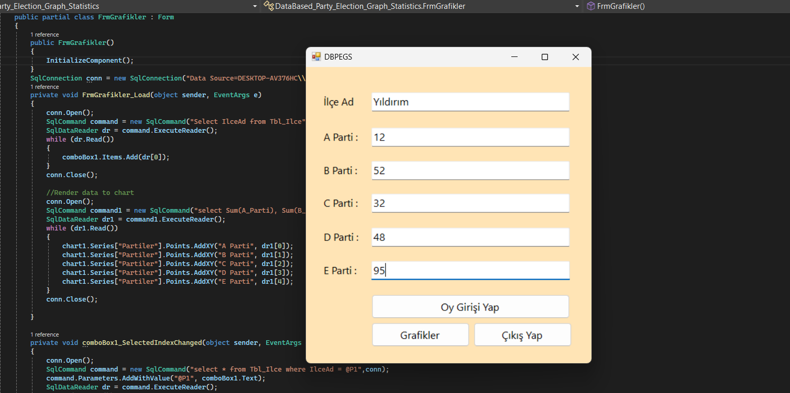
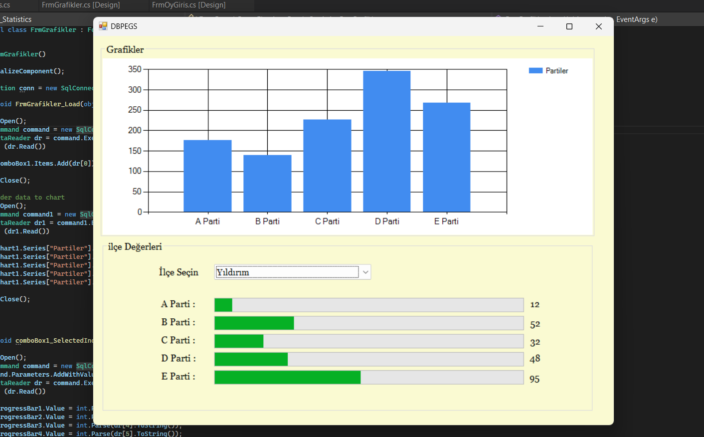

# Voting Application

In this project, I developed a voting application using Windows Forms. Users can enter and submit their votes by selecting districts, and if they wish, they can view the total data in graphical form.

## Features

- **Voting Page**: 
  - Users can enter their votes.
  - Users can select districts to vote.
  - Users can view the total data in graphical form.

## Screenshots



## Installation

1. Clone the repository:
    ```bash
    git clone https://github.com/DifferenTismail/YirmiBes_Dersde_YirmiBes_Proje.git
    ```
2. Navigate to the project directory:
    ```bash
    cd DataBased_Party_Election_Graph_Statistics
    ```
3. Open the solution file (`.sln`) in Visual Studio.
4. Restore the NuGet packages.
5. Build the solution.
6. Run the application.

## Usage

1. Launch the application.
2. Navigate to the voting page to submit your votes.
3. Select districts and submit your votes.
4. Optionally, view the total data in graphical form.

## Contributing

Contributions are welcome! Please open an issue or submit a pull request.

## License

This project is licensed under the MIT License.
