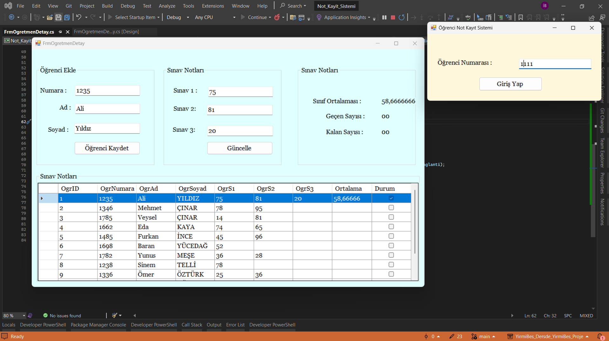

# Student Grade Recording System

In this project, I developed a student grade recording system using Windows Forms. Students can view their own grades, grade averages, and statuses if they wish.

## Features

- **Student Page**: 
  - Students can view their grades.
  - Students can view their grade averages.
  - Students can view their statuses.

- **Teacher Page**: 
  - Teachers can enter grades for any student.
  - Teachers can update existing grades.

## Screenshots




## Installation

1. Clone the repository:
    ```bash
    git clone https://github.com/DifferenTismail/YirmiBes_Dersde_YirmiBes_Proje.git
    ```
2. Navigate to the project directory:
    ```bash
    cd YirmiBes_Dersde_YirmiBes_Proje
    ```
3. Open the solution file (`.sln`) in Visual Studio.
4. Restore the NuGet packages.
5. Build the solution.
6. Run the application.

## Usage

1. Launch the application.
2. Navigate to the student page to view grades and averages.
3. Navigate to the teacher page to enter or update grades.

## Contributing

Contributions are welcome! Please open an issue or submit a pull request.

## License

This project is licensed under the MIT License.
