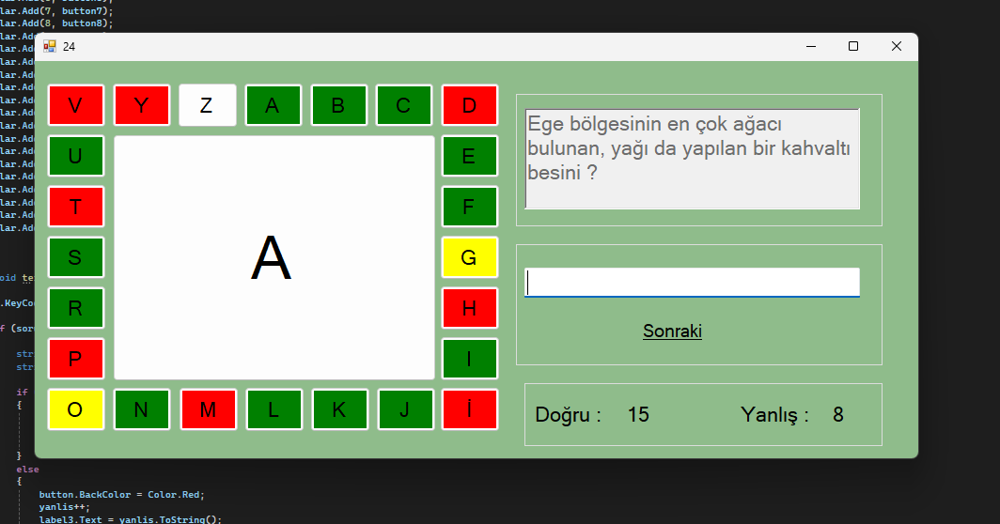

# Passaparola Game

Welcome to the Passaparola Game! This project is a simple quiz game where you can answer questions using the Enter key. Depending on your answer, the game will indicate whether you are correct or incorrect and update your score accordingly.

## How to Play

1. **Answer Questions**: Enter your answers into the textbox and press the Enter key.
2. **Correct Answers**: If your answer is correct, the background of the corresponding letter button will turn green, and your correct answer count will increase by 1.
3. **Incorrect Answers**: If your answer is incorrect, the background of the corresponding letter button will turn red, and your incorrect answer count will increase by 1.

## Features

- **Dynamic Question and Answer System**: Each letter corresponds to a different question.
- **Real-time Feedback**: Instantly see whether your answer is correct or incorrect.
- **Score Tracking**: Keep track of your correct and incorrect answers.

## Screenshots

Here are some screenshots of the game in action:


*This game last question.*


## Installation and Setup

1. Clone the repository to your local machine.
   ```sh
   git clone https://github.com/DifferenTismail/YirmiBes_Dersde_YirmiBes_Proje.git
